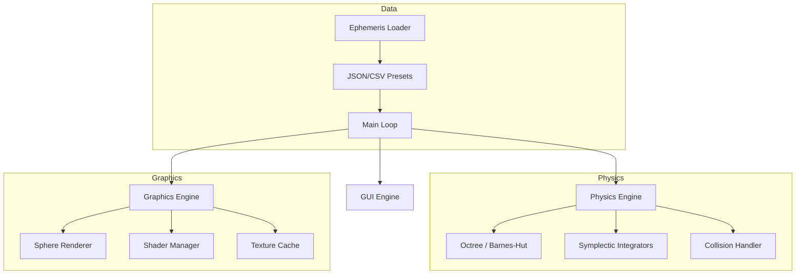

# Solar System Simulation

A professional-grade 3D solar system simulation built in C++ with OpenGL, featuring realistic physics, real ephemeris data, and an interactive Dear ImGui interface.

  

## Features

### Physics Engine
- **Multiple Integrators**: Velocity Verlet, 4th-order Runge-Kutta (RK4), and Barnes-Hut (O(N log N))
- **Performance Optimized**: SIMD-accelerated force calculations and pool-based Octree allocation
- **Adaptive Timestepping**: Automatically adjusts timestep based on body proximity
- **Collision Detection**: Inelastic merging with conservation of momentum
- **Energy Conservation**: Symplectic integration maintains energy over long timescales

### Graphics
- **3D OpenGL Rendering**: Hardware-accelerated with shaders
- **Phong Lighting**: Realistic lighting with the Sun as light source
- **Textures**: NASA planetary textures for visual realism
- **Orbital Trails**: Fading trails showing orbital paths
- **3D Camera**: Orbit, free-fly, and follow modes

### Data & Accuracy
- **J2000 Ephemeris**: Real NASA/JPL Keplerian orbital elements
- **Keplerian Solver**: Newton-Raphson iteration for Kepler's equation
- **All Major Bodies**: Sun, 8 planets, Moon, dwarf planets (Pluto, Ceres, Eris, Makemake, Haumea)
- **Asteroid Belt**: 200 procedurally placed asteroids

### Interactive GUI (Dear ImGui)
- Time controls (pause, play, time rate adjustment)
- Camera controls with live adjustment
- **Accessibility Features**:
    - High-contrast Dark/Light mode toggle
    - Keyboard navigation (WCAG 2.1 AA compliant focus indicators)
    - Non-blocking toast notifications for system events
- Visibility toggles (trails, axes, asteroids, labels)
- Integrator selection
- Body information panel with orbital details
- Preset scenarios (Inner Planets, Outer Giants, Earth-Moon, Binary Star)
- Save/Load simulation state
- **Historial Tracking**: Undo/Redo simulation steps and mark significant epochs

## Design Philosophy

SolarSim is built on three core pillars:
1. **Physical Accuracy**: We use real J2000 ephemeris data (positions and velocities) for the starting state. The integrators (Verlet, RK4) are chosen for their energy-preservation properties.
2. **Visual Literacy**: Real space is mostly empty. To make a "sim" that is actually usable, we apply a **Logarithmic-Linear Hybrid Scaling** to distances. This ensures that while Earth and its Moon are visible, you can still see Neptune without zooming out until the Sun is a single pixel.
3. **Performance First**: N-Body simulations are $O(N^2)$. We utilize **Barnes-Hut** spatial partitioning and **SIMD** instructions to keep the frame rate smooth even with hundreds of asteroids.

## Architecture Overview



## Building

### Prerequisites
- CMake 3.14+
- C++17 compatible compiler:
  - **Windows**: MSVC 2019+ or MinGW-w64
  - **Linux**: GCC 9+ or Clang 10+
- OpenGL 4.5+ capable graphics card (using Compatibility Profile)
- **Linux dependencies** (Debian/Ubuntu): `libgl1-mesa-dev`, `libxrandr-dev`, `libxcursor-dev`, `libxi-dev`, `libudev-dev`, `libopenal-dev`, `libvorbis-dev`, `libflac-dev`, `xvfb` (for headless)

### Build Instructions

```bash
# Clone the repository
git clone https://github.com/therealsahil19/C-Solar-Sim.git
cd C-Solar-Sim

# Standard Build
mkdir build && cd build
cmake ..
cmake --build .

# Run
./SolarSim               # Linux/macOS
./Debug/SolarSim.exe     # Windows (MSVC)
```

### Windows-Specific Notes
If using Visual Studio/MSVC, we recommend using PowerShell:
1. Open PowerShell in the project root.
2. Run `cmake -B build -G "Visual Studio 17 2022" -A x64`
3. Run `cmake --build build --config Release`
4. The executable will be in `build/Release/SolarSim.exe`.

> [!TIP]
> All dependencies (SFML, ImGui, GLM) are automatically fetched. Ensure you have an active internet connection on the first build.

## Controls

### Keyboard & Mouse

| Input | Action |
|-------|--------|
| **W / S** | Pitch camera up/down |
| **A / D** | Rotate camera left/right |
| **Left Click + Drag**| Orbit rotation around selection |
| **Right Click + Drag**| Pan view horizontally/vertically |
| **Scroll Wheel** | Zoom in/out |
| **Space** | Toggle pause simulation |
| **T** | Toggle orbital trails |
| **H** | Open Help & Shortcuts modal |
| **Up / Down Arrows**| Navigate bodies in Info Panel |

### GUI Panels
- **Simulation Controls**: Time rate, pause/play, presets, save/load
- **Camera Controls**: Distance, pitch, yaw adjustments
- **Visibility**: Toggle trails, axes, labels, asteroids
- **Body Information**: Select body to view detailed stats
- **Statistics**: FPS, body count, energy drift, integrator info

## Project Structure

```
Solar-Sim/
├── include/           # Header files
│   ├── Body.hpp           # Celestial body class
│   ├── Camera3D.hpp       # 3D camera system
│   ├── ConfigLoader.hpp   # Configuration loading
│   ├── ConsoleRenderer.hpp# Console output (legacy)
│   ├── Constants.hpp      # Physical constants
│   ├── DataExporter.hpp   # CSV export
│   ├── EphemerisLoader.hpp# J2000 data loader
│   ├── GraphicsEngine.hpp # OpenGL rendering
│   ├── GuiEngine.hpp      # ImGui interface
│   ├── KeplerianSolver.hpp# Orbital elements solver
│   ├── Octree.hpp         # Barnes-Hut algorithm
│   ├── PhysicsEngine.hpp  # Physics calculations
│   ├── ShaderProgram.hpp  # Shader management
│   ├── SphereRenderer.hpp # Sphere geometry
│   ├── StateManager.hpp   # Save/load functionality
│   ├── SystemData.hpp     # System initialization
│   ├── Validator.hpp      # Physics validation
│   ├── Vector3.hpp        # 3D vector math
│   └── glad.h             # Custom OpenGL loader header
├── src/
│   ├── main.cpp          # Application entry point
│   └── glad.cpp          # Custom OpenGL loader implementation
├── shaders/
│   ├── planet.vert/frag  # Planet rendering shaders
│   ├── sun.frag          # Sun emission shader
│   └── trail.vert/frag   # Orbital trail shaders
├── textures/             # Planetary textures
├── data/
│   └── system.csv        # Body configuration data
└── CMakeLists.txt        # Build configuration
```

## Physics Model

### Units
- **Distance**: Astronomical Units (AU)
- **Time**: Years
- **Mass**: Solar masses

In these units, the gravitational constant G = 4π² ≈ 39.478.

### Integration Methods

| Method | Complexity | Energy Drift | Best For |
|--------|------------|--------------|----------|
| Verlet | O(N²) | Very Low | Long-term stability |
| RK4 | O(N²) | Low | High accuracy |
| Barnes-Hut | O(N log N) | Low | Large N simulations |

## Preset Scenarios

1. **Full Solar System**: All planets, dwarf planets, and 200 asteroids
2. **Inner Planets**: Mercury, Venus, Earth, Mars
3. **Outer Giants**: Jupiter, Saturn, Uranus, Neptune
4. **Earth-Moon System**: Focused Earth-Moon dynamics
5. **Binary Star Test**: Two equal-mass stars in orbit

## Troubleshooting

### "Failed to open shader file"
> [!IMPORTANT]
> Shaders must be located in the `shaders/` directory relative to the current working directory.
If running from an IDE (like VS Code or Visual Studio), ensure the "Working Directory" is set to the project root, or copy the `shaders/` and `textures/` folders to the directory where the `.exe` resides.

### "DLL Not Found"
On Windows, CMake is configured to automatically copy required DLLs to the build folder. If they are missing:
1. Re-run the CMake configure step.
2. Manually copy DLLs from `build/_deps/<package>-build/` to the directory containing `SolarSim.exe`.

### White Spheres / Missing Textures
Ensure the `textures/` folder is available in the working directory. The simulation expects `.jpg` or `.png` textures for each body.

### Simulation "Explodes" / Bodies Fly Away
This usually happens if the timestep ($dt$) is too large for a close encounter. 
- **Fix**: Switch to **Adaptive Timestepping** in the GUI or reduce the time rate. 
- **Physics Note**: Even with RK4, if two bodies are at the same coordinate, the force $1/r^2$ becomes infinite. Our "Softening" factor prevents $NaN$, but kinetic energy will still skyrocket.

## Contributing

Please see [CONTRIBUTING.md](CONTRIBUTING.md) for development guidelines and verification procedures.

## License

This project is licensed under the MIT License - see the [LICENSE](LICENSE) file for details.

## Acknowledgments

- NASA/JPL for ephemeris data
- SFML team for multimedia library
- Dear ImGui for immediate mode GUI
- GLM for mathematics library
